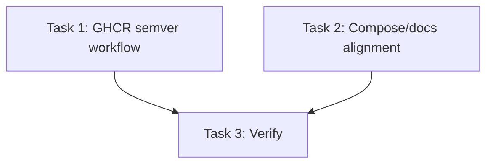

# GHCR Release Convergence Plan

## Overview
- **Total Phases**: 1
- **Total Tasks**: 3
- **Tracking Mode**: LOCAL_ONLY

## Phase 1: Release Surface Convergence
| # | Task | Priority | Effort | S.U.P.E.R | Test Expectation | Acceptance Criteria |
|:--|:--|:--|:--|:--|:--|:--|
| 1 | Add tag-triggered semver GHCR publishing | P0 | S | U, R | YAML parse + workflow diff review | `cd-chat.yml` publishes `latest`, `YYYYMMDD`, short SHA, `X.Y.Z`, `X.Y`. |
| 2 | Align compose/docs to GHCR image | P0 | S | S, E | `docker compose config` | `docker-compose.yml`, README, RELEASE all name `ghcr.io/tokendancelab/tokendance-chat`. |
| 3 | Verify build/test surfaces | P0 | M | P, R | backend/frontend/compose validation | Core tests/builds pass locally before commit. |

## Dependency Graph

## Milestone
| Milestone | Criteria | Status |
|:--|:--|:--|
| Release surface converged | Workflow, docs, compose, and verification agree on one GHCR image. | In progress |
